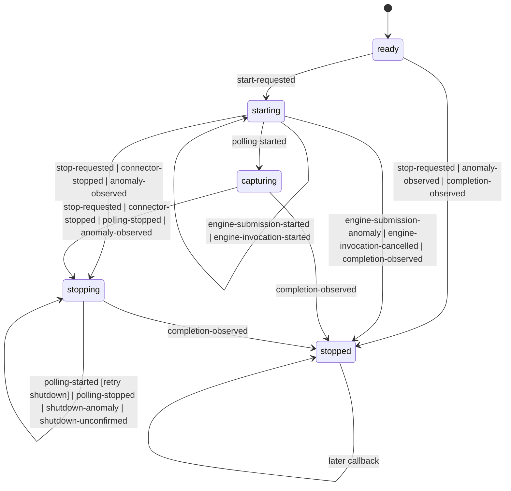

# Change-Capture Lifecycle Contract

## Job

An application embedding Debezium must be able to determine whether this
wrapper is currently capturing changes. It must preserve offsets when the
upstream engine, the wrapper protocol, or the application consumer fails.

This contract deliberately distinguishes what the wrapper **observes** from
what it **concludes**. An upstream callback is not evidence that its claimed
lifecycle transition is valid.

## Observations

The wrapper records an ordered, append-only trace of domain observations for
one engine instance. The following are facts: they say what was requested,
started, returned, or received. They do not assert a lifecycle phase.

| Origin | Observation | Fact recorded |
| --- | --- | --- |
| Wrapper API | A caller starts the engine. | `start-requested` |
| Wrapper executor | The wrapper began executor submission, entered the raw engine invocation, rejected submission, or cancelled a queued invocation. | `engine-submission-started`, `engine-invocation-started`, `engine-submission-anomaly`, or `engine-invocation-cancelled` |
| Debezium | `connectorStarted` callback arrived. | `connector-started` |
| Debezium | `connectorStopped` callback arrived. | `connector-stopped` |
| Debezium | `pollingStarted` callback arrived. | `polling-started` |
| Debezium | `pollingStopped` callback arrived. | `polling-stopped` |
| Debezium | Completion callback arrived. | `completion-observed`, with its translated outcome |
| Wrapper API | A caller requests shutdown. | `stop-requested` |
| Wrapper-to-Debezium call | The wrapper began a shutdown request, received its return, or caught its failure. | `shutdown-request-started`, `shutdown-returned`, or `shutdown-anomaly` |
| Application boundary | A batch was admitted, returned normally, or failed. | `batch-admitted`, `batch-handled`, or `consumer-anomaly` |
| Wrapper-to-committer call | The wrapper began a record or batch acknowledgement, received its return, or caught its failure. | `record-acknowledgement-started`, `record-acknowledged`, `batch-acknowledgement-started`, `batch-acknowledged`, or `acknowledgement-anomaly` |
| Wrapper deadline | Shutdown remained unconfirmed past its deadline. | `shutdown-unconfirmed` |

An anomaly observation contains an ordinary Cognitect Anomalies map. A
protocol anomaly is also an observation, but it is *derived* from an observed
fact that cannot extend the normal callback trace. This retains both the raw
fact and the interpretation made from it.

The terminal outcome retains an anomaly observed before a successful completion
or cancelled invocation; a failed completion is itself terminally anomalous.
Later anomalies remain observations for diagnosis but cannot replace either
already observed nil outcome.

## Offset-store precondition

`create-engine` requires `::config` to contain Debezium's `:offset.storage`
setting. Omitting it returns a `:cognitect.anomalies/incorrect` anomaly; the
library supplies no implicit `MemoryOffsetBackingStore` default. The configured
store is an external dependency and must meet the Debezium / Kafka Connect
`OffsetBackingStore` contract. Offset durability is conditional on that
contract, not independently proven by the wrapper.

`MemoryOffsetBackingStore` is an explicit test fixture in
`debezium-embedded.core-test`, not a public library helper. It opts out of
offset continuity across a fresh handle and is not suitable for recovery that
relies on replaying from a durable checkpoint.

## Interpretation

`phase`, shutdown necessity, and record admissibility are pure interpretations
of the observation trace. They are not independently mutable fields and are
not facts about Debezium.

| Interpreted phase | Meaning |
| --- | --- |
| `ready` | No start request has been observed. |
| `starting` | Start was requested, but polling has not started and stopping or completion is not required. |
| `capturing` | Polling started and no stop request, stop observation, completion, or anomaly requires safe shutdown. |
| `stopping` | Safe shutdown is required and completion has not been observed. |
| `stopped` | Execution could not begin or was cancelled, completion was observed, or stopping was requested before any start request. |

`running?` is true exactly when the interpreted phase is `capturing`.

Record admission is another interpretation, not a lifecycle state or a
delivery policy. A record may be passed to the application consumer and its
offset may be acknowledged only while the trace interprets as `capturing`.

## Ownership boundary

The public creation API returns a wrapper-owned capture handle, never a raw
`DebeziumEngine`. Lifecycle commands use the `(fn target arg-map)` shape:

```clojure
(start! handle {})
(start! handle {:executor executor})
(stop! handle {})
(stop! handle {:timeout-ms timeout-ms})
```

Handle creation is a long-lived, extensible configuration map and uses fully
qualified keys from the public `debezium-embedded.core` namespace. In that
namespace the implementation writes `::default-shutdown-timeout-ms` and
`::on-event`; their expanded public names are
`:debezium-embedded.core/default-shutdown-timeout-ms` and
`:debezium-embedded.core/on-event`. Command argument maps are short-lived
information passed only to their target, so their keys are unqualified.

The required creation keys are `::config` and `::consumer`. Optional keys are
`::default-shutdown-timeout-ms` and `::on-event`.

`start!`, `stop!`, and `running?` are the only lifecycle operations. `start!`
uses a wrapper default executor unless its argument map supplies `:executor`;
it records the start request and controls submission itself. `stop!` is the
only operation that can request upstream shutdown. Its default timeout is the
handle's `:debezium-embedded.core/default-shutdown-timeout-ms`, which defaults
to 2000 milliseconds; `:timeout-ms` overrides it for one call. `stop!` awaits
termination and returns nil only for confirmed normal termination, otherwise a
domain anomaly.

A `Closeable` compatibility method delegates to `(stop! handle {})` and may
expose its anomaly only as `ExceptionInfo` data at the Java boundary.

The creation contract is:

```clojure
(create-engine {::config                       debezium-config
                ::consumer                     consume-events
                ::default-shutdown-timeout-ms  2000 ; optional
                ::on-event                     observe-event}) ; optional
;; => handle | anomaly
```

`::config` contains Debezium connector configuration, including the required
`:offset.storage`. `::consumer` retains the existing event-map contract. The
former raw completion and connector callbacks are removed; `::on-event`
receives their translated wrapper events instead.

The handle is not a `Runnable` adapter for the raw engine. Existing callers
that submit the result of `create-engine` directly to an executor must migrate
to `start!`. This is an intentional compatibility break: retaining direct
`run` or `close` access would let callers bypass the trace linearizer and make
this contract false.

`::on-event` is an optional observability hook for logging, metrics, and
tracing. It receives fully qualified wrapper observations, never a raw
Debezium callback, throwable, message, or derived phase-change event; it does
not participate in lifecycle control. Its return value is ignored and its
failure cannot change lifecycle, consumer, or acknowledgement outcomes. The
wrapper delivers it asynchronously through an implementation-owned, bounded,
FIFO queue. Enqueueing never waits for lifecycle work; on queue overflow or
hook failure the notification is discarded. Delivered notifications retain
trace order. A hook may call public lifecycle operations, but it cannot
re-enter or block the trace linearizer.

```clojure
{:debezium-embedded.core/event       :debezium-embedded.core/observation-recorded
 :debezium-embedded.core/observation :debezium-embedded.core/polling-started}
```

## Interpreted lifecycle



The diagram gives the phase conclusion, not a claim about the engine's actual
private state. `completion-observed` always concludes `stopped`: the callback
is evidence that the engine invocation has ended. When it arrives from
`starting` or `capturing`, the missing stop boundary also derives a protocol
anomaly. A later callback from `stopped` derives a protocol anomaly but cannot
make the lifecycle capture-capable again.

An anomaly observed before completion from `starting`, `capturing`, or
`stopping` concludes `stopping`, including a consumer anomaly, a translated
upstream failure, a shutdown anomaly, and a protocol anomaly. The wrapper must
then start shutdown if it has not already started it. A shutdown request that
throws does not alter this conclusion: the phase remains `stopping` until
completion is observed.

An anomaly or completion observed from `ready` concludes `stopped`: there is
no started engine for the wrapper to preserve, and accepting a later start
would violate the terminal safety boundary.

## Shutdown retry and confirmation

`stopping` means that shutdown is required, not that an upstream shutdown call
has succeeded. The wrapper records `shutdown-request-started` before entering
the upstream call and then records its result. If Debezium rejects that request
while it is starting, the wrapper
records `shutdown-anomaly`, continues to withhold record admission, and starts
one further shutdown request only when it later observes `polling-started`.
Repeated `stop!` calls do not add requests. No retry is a busy loop.
This is limited to a failure before the first polling start; a duplicate
`polling-started` after capture cannot trigger another shutdown request.

If neither `completion-observed` nor a retry trigger arrives before the
configured shutdown-confirmation deadline, the wrapper records a
`:cognitect.anomalies/unavailable` `shutdown-unconfirmed` anomaly.
`stop!` returns that anomaly, but the interpreted phase remains `stopping`;
the wrapper must not create or start a replacement engine from that handle. A
later completion still concludes `stopped`. This distinguishes "shutdown
request failed" from the false claim that the engine has stopped.

The 2000-millisecond default is a wrapper responsiveness deadline, not a claim
that Debezium can complete graceful shutdown within that interval. Callers that
need a longer graceful wait must pass `:timeout-ms` explicitly.

## Normal callback trace

The only trace that makes record admission true is this prefix:

```text
start-requested → engine-submission-started → engine-invocation-started
→ connector-started → polling-started
```

It remains admissible only until the first `stop-requested`, `polling-stopped`,
`completion-observed`, or anomaly observation. Thus, `capturing` is never
inferred from an engine allocation, a submitted task, or a raw callback after
a stop condition.

The normal shutdown continuation is:

```text
starting → connector-started → polling-started → capturing
capturing → (stop-requested | connector-stopped | polling-stopped) → stopping → completion-observed → stopped
```

`stop-requested` from `ready` concludes `stopped` without contacting an engine.
All other callback orders remain observable facts, but derive a protocol
anomaly and a non-capturing conclusion rather than being accepted as normal
transitions.

The wrapper linearizes public start and stop requests with the start of a raw
engine invocation. Consequently, a stop observed after `start-requested` but
before the invocation begins records `engine-invocation-cancelled`; a later
start request is an invalid wrapper command. A queued invocation is never
silently allowed to begin after a trace has concluded `stopped`.
An executor rejection reported after that cancellation remains a diagnostic
observation and does not turn the not-started outcome into a terminal anomaly.

## Wrapper-observable shutdown confirmation

`stop!` returns nil only when the trace confirms one of these
wrapper-observable outcomes:

| Outcome | Required facts |
| --- | --- |
| Not started | `stop-requested` from `ready`, or `engine-invocation-cancelled`; no `engine-invocation-started` fact. |
| Started and graceful | Successful `completion-observed`; no terminal anomaly; the number of `batch-acknowledged` observations is at least the number of `batch-admitted` observations; `connector-started` implies a later `connector-stopped`. |

The configured `OffsetBackingStore` is an explicit external precondition to
the second outcome. The wrapper relies on that store's Debezium / Kafka Connect
contract; it does not invent an unverifiable offset-store completion fact.

`completion-observed` alone is insufficient. In particular, a completion that
lacks required connector-stop evidence derives a domain anomaly rather than
confirming graceful shutdown. `polling-started` deliberately has no matching
`polling-stopped` requirement: Debezium 3.6 may invoke `pollingStarted`, accept
the wrapper's startup-shutdown retry, reject polling-task submission, and
complete normally without invoking `pollingStopped`. That trace admits no
records after the retry. Its preceding `shutdown-anomaly` is terminally
anomalous, so it is a safe terminal outcome, not a graceful-success result.

The trace has no public batch identity, so its aggregate acknowledgement counts
are not a proof that a particular admitted batch reached durable storage. The
wrapper's stronger, structural guarantee is only about the start of an
acknowledgement: it is recorded while the trace is capturing. Nil does not
attest to durable offset persistence. Debezium may suppress an
`OffsetBackingStore.stop` failure before completion, so this wrapper cannot
observe it. The configured store remains an external precondition; when an
observable acknowledgement or lifecycle anomaly occurs, `stop!` returns it
and the wrapper does not claim graceful completion.

| Trace outcome | `stop!` result |
| --- | --- |
| Not started | nil |
| `engine-submission-anomaly` before cancellation | That anomaly |
| Started and graceful | nil |
| Primary anomaly or missing graceful-shutdown evidence | That anomaly |
| Shutdown deadline elapsed | `shutdown-unconfirmed` anomaly |

## Domain errors

Every error exposed by the wrapper is an ordinary Cognitect Anomalies map.
The map uses a standard category and carries source context:

```clojure
{:cognitect.anomalies/category :cognitect.anomalies/fault
 :cognitect.anomalies/message  "Debezium engine completed unexpectedly"
 :debezium-embedded/source     :upstream
 :debezium-embedded/cause      throwable}
```

- An anomaly already carried by `ExceptionInfo` is preserved.
- An interrupted cause is translated to `:cognitect.anomalies/interrupted`.
- A recognised transient connection cause is translated to
  `:cognitect.anomalies/unavailable`.
- Other upstream failures and wrapper protocol violations are
  `:cognitect.anomalies/fault`.
- Invalid wrapper commands are
  `:cognitect.anomalies/incorrect` and do not manufacture an upstream fact.

Translated errors are observations. The original throwable is retained as
context; callers must not need to parse exception messages or upstream types.

## Safe failure behaviour

Before invoking the application consumer, the wrapper interprets the current
trace. If a batch is not admissible, it does not invoke the consumer,
`markProcessed`, or `markBatchFinished`.

If parsing an upstream event or invoking the application consumer produces an
anomaly, the wrapper records that anomaly before it acknowledges any further
record or batch. It then interprets as `stopping` (or `stopped` if completion
was already observed). A record can be marked processed only after its
application handling completed normally; a batch can be finished only after
all of its records were marked normally.

Observations, the start of each external operation, and start/stop submission
for one engine are linearized by the wrapper. The pure interpreter decides
whether an acknowledgement may start; the same transition records
`*-acknowledgement-started`. The external committer call then happens outside
that transition, and its return or throw is recorded afterwards. Consequently,
a barrier that linearizes before the start prevents that operation. If the
start linearizes first, one in-flight external committer call may occur after a
concurrent barrier; the wrapper cannot make that external I/O atomic without
taking ownership of Debezium's committer. An acknowledgement anomaly itself
requires stopping and forbids later acknowledgement starts.

The wrapper cannot determine whether a committer that throws persisted an
offset before throwing. It makes no stronger claim; it exposes the anomaly and
does not issue another acknowledgement. Records handled before the first
anomaly may be replayed after recovery. This is an at-least-once contract and
requires consumers to tolerate duplicates; it cannot make an external consumer
side effect transactional.

The wrapper does not restart automatically. A fresh handle may be constructed
only after the previous handle has observed completion; an unconfirmed shutdown
requires external recovery rather than a second local engine.

## Verification requirements

The lifecycle interpreter is verified without relying on Debezium behaving
correctly.

- Check the finite-state quotient for arbitrary recognised callback input,
  including duplicate, reordered, and post-completion callbacks. `capturing`
  may be concluded only for the normal admissible prefix; no barrier or
  anomaly may conclude `capturing` later. Separately, interpreter tests retain
  every raw callback in the concrete trace, including suffixes the quotient
  can merge.
- Assert that completion from `starting` or `capturing` concludes `stopped`
  and records a protocol anomaly rather than a clean shutdown.
- Assert the graceful-shutdown predicate for every terminal trace: a started
  trace returns nil only when its aggregate batch acknowledgement evidence and
  connector-stop evidence are present. Include the
  startup-shutdown retry trace that has `polling-started` but no
  `polling-stopped` and admits no record.
- Simulate a shutdown rejection during startup, then `polling-started`. Assert
  a retry occurs before any record admission and the lifecycle remains
  `stopping` until completion. Simulate a missing retry trigger and assert the
  shutdown-confirmation deadline returns `shutdown-unconfirmed`, not `stopped`.
- Race observations, consumer outcomes, acknowledgement starts, and
  acknowledgement failures. Assert that a barrier which linearizes before a
  start prevents it, and that an acknowledgement exception forbids later
  starts. Do not assert that a barrier can retract an already-started
  external committer call.
- Feed a consumer anomaly while a batch is pending. Assert that no subsequent
  record or batch acknowledgement occurs and that the completion result
  exposes the same domain anomaly.
- Block, throw from, and re-enter `stop!` through `::on-event`. Assert that
  trace interpretation and shutdown progress continue, and that overflowing
  its queue can discard notifications but cannot block lifecycle work.
- Verify the compliant PostgreSQL integration sequence:
  `ready → starting → capturing → stopping → stopped`.
- Assert that the public handle exposes no raw Debezium engine and that only
  `start!` and `stop!` can submit or stop an invocation.

## Structural guarantee

The observation trace is the only mutable lifecycle input. Phase, record
admission, and graceful-shutdown confirmation are total functions of that
trace, so no caller can assign a phase or construct a second, conflicting
safety state. The wrapper is also the only component that may invoke the
external committer, and each such invocation has an ordered acknowledgement
observation.

By the normal-prefix rule, every trace containing a stop condition,
completion, or anomaly has non-admissible record handling. `polling-started`
also requires exactly one prior `connector-started`; a repeated connector
callback, a connector stop without a start, or polling without a connector is
an invalid trace. Appending more facts cannot remove those facts. Therefore an
untrusted upstream callback may produce an anomaly, but cannot structurally
cause a later capture-capable interpretation for the same engine instance.

The trace is held in one atom. Each observation append and each external
operation start is a compare-and-set transition over the whole immutable trace.
The decision and its `*-started` fact therefore have one linearization point: a
concurrent stop either precedes an acknowledgement start and prevents it, or
follows it. Engine close, completion waiting, hook dispatch, consumer work,
and committer I/O all happen after that transition and never while a monitor,
STM transaction, or CAS retry loop is held. The pure phase function also
rejects malformed callback sequences even when it receives a trace that lacks
the derived protocol-anomaly observation; the wrapper's append path then
records that anomaly for diagnosis.

Tests exercise this proof's boundaries; they are not its source.

The executable protocol model is
[`tla/EngineLifecycle.tla`](../../tla/EngineLifecycle.tla). It is a compact
state quotient, not the trace itself: phase, normal-protocol facts,
shutdown/retry facts, one abstract batch, and the first malformed callback.
It accepts every callback as an input; the first one that cannot extend the
normal protocol records both its raw kind and a protocol anomaly, then reaches
a non-capturing state. TLC therefore checks the full finite decision state
rather than an arbitrary trace-length prefix. The concrete interpreter tests
cover raw-trace retention. The model checks acknowledgement starts, the engine
invocation boundary, at most one startup shutdown retry, malformed-input
retention, and graceful-completion evidence. External committer I/O occurs
after an acknowledgement start and is deliberately outside the model. This is
a safety proof for the wrapper's decisions, not a liveness proof or a proof of
offset-store durability.
